# ProductStore

project setup

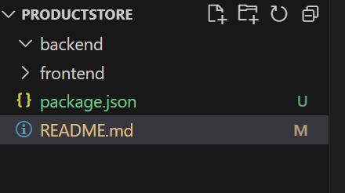

`npm init -y`

`npm install express mongoose dotenv`

Express - webframework - to build API and routes
Mongoose - interact with Mongo DB
Dotenv - Access to our .env or environment variables

# backend 

- create entry point server.js in backend

Verify the setup

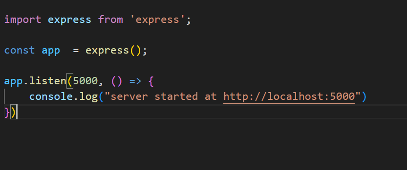

update `package.json` to `"dev": "node backend/server.js"` to call the application with `npm run dev`

for every change in backend application, install the package `nodemon` 

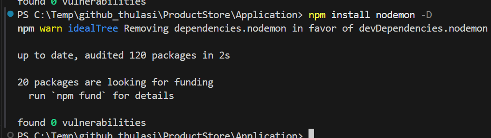
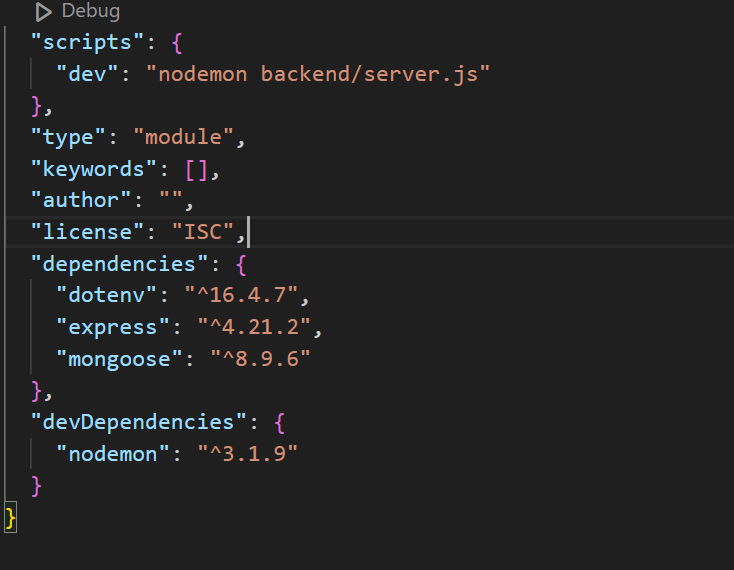
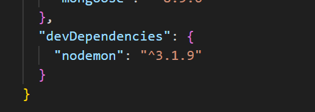

Test with first route ( homepage )
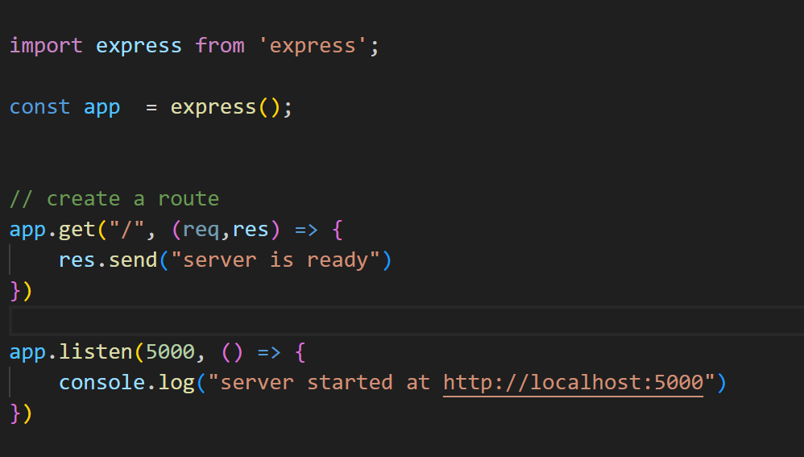
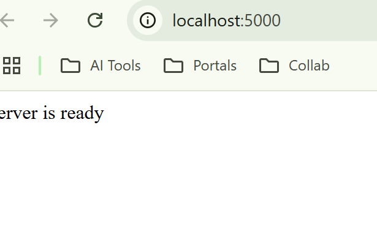

# setup mongo DB :

- organization
-  project
   - cluster ( free tier)
   - create a sample user and make as project owner
   - create a DB user and copy the connection string
   - mode of connection : driver Node => ( npm install mongodb)

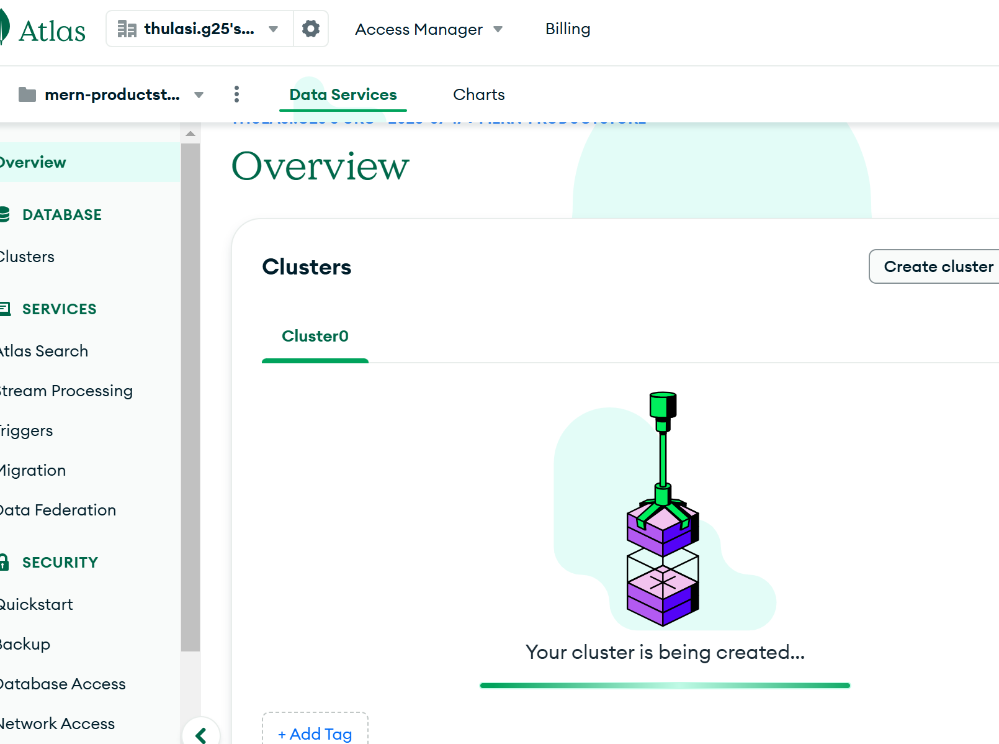

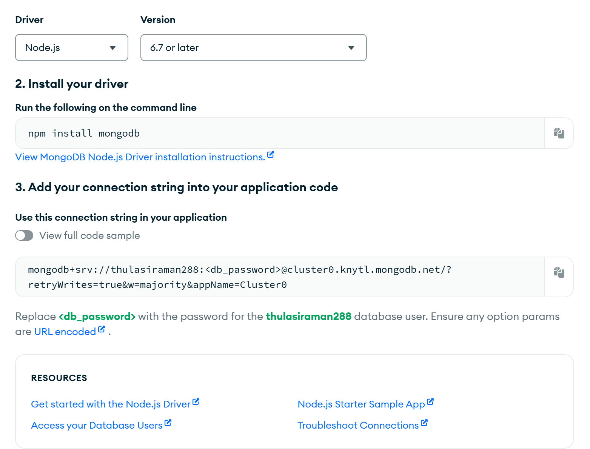

##  Setup DB connection function and import in app,

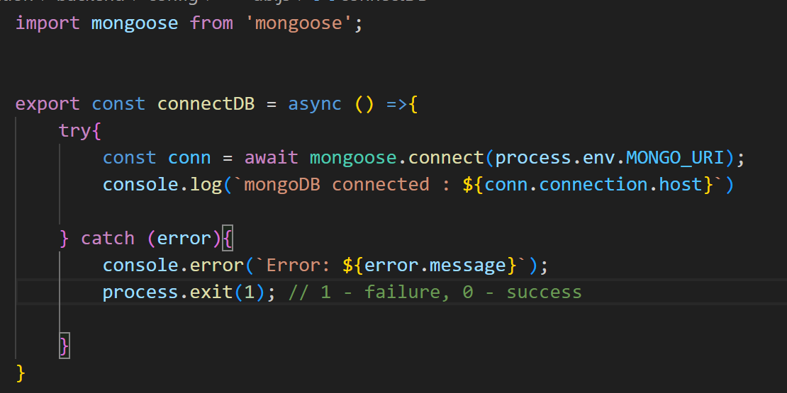
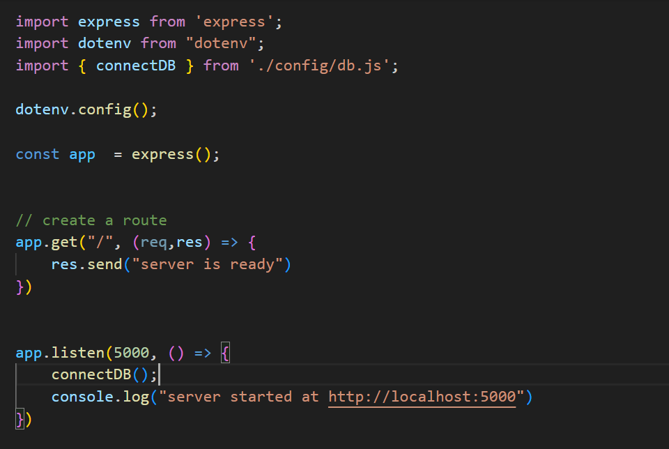

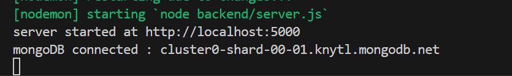

